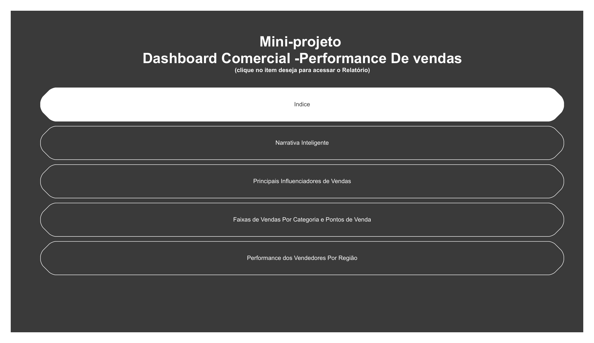
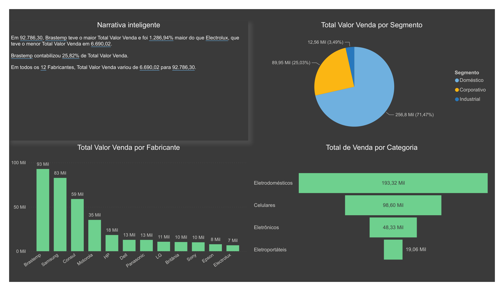
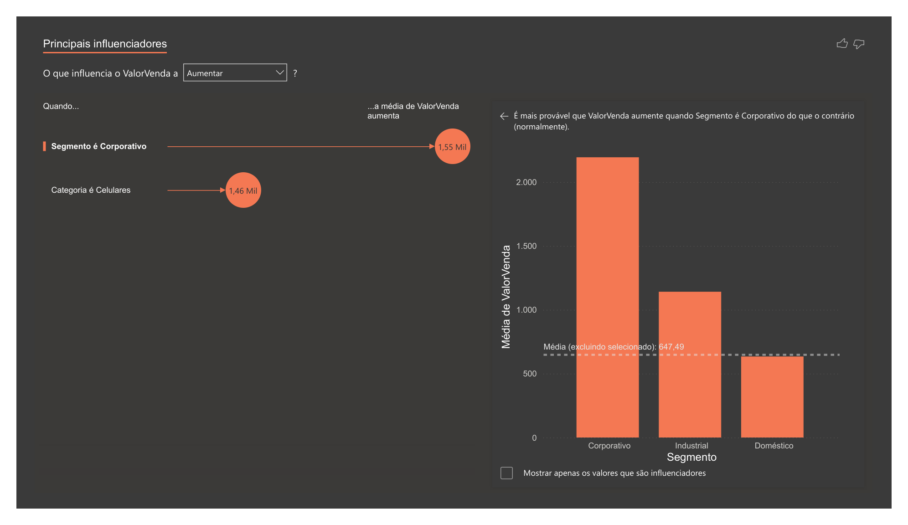
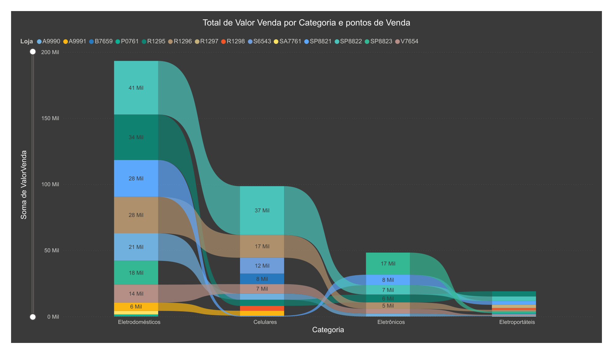
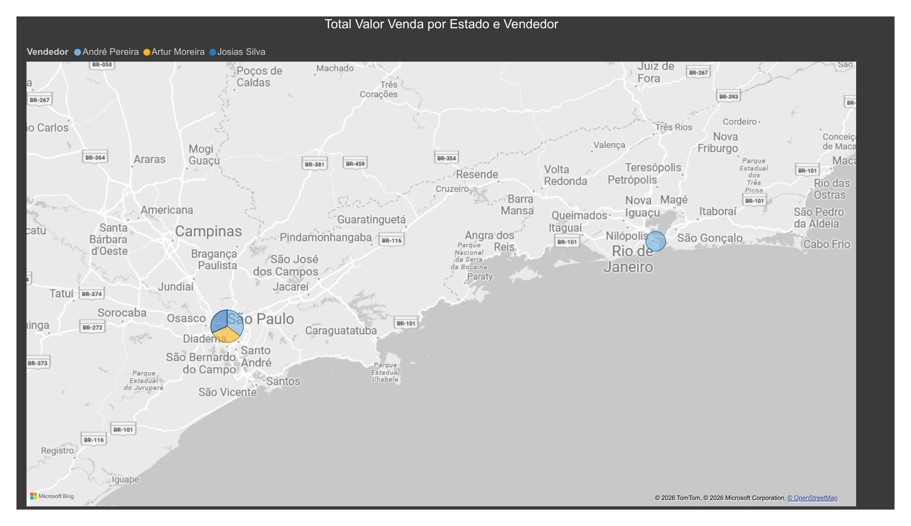

# 📊 Commercial Sales Dashboard — Power BI

Dashboard desenvolvido como parte dos estudos práticos em **Power BI**, com foco na análise de desempenho comercial e acompanhamento de indicadores de vendas.

## 🎯 Objetivo

O projeto tem como objetivo explorar dados comerciais e apresentar informações relevantes para análise de vendas, permitindo visualizar o desempenho por **fabricantes, categorias, segmentos, pontos de venda e regiões**.

## 📈 Análises do Dashboard

O relatório apresenta diferentes perspectivas de análise, incluindo:

- Desempenho geral de vendas;
- Análise por fabricante e categoria;
- Comparação entre segmentos;
- Desempenho dos pontos de venda;
- Análise por região;
- Indicadores e métricas comerciais;
- Visualização dos principais resultados em dashboards interativos.

## 🛠️ Ferramentas

- **Power BI** — desenvolvimento e visualização do dashboard;
- **Power Query** — tratamento e transformação dos dados;
- **DAX** — criação de medidas e indicadores;
- **Excel** — fonte e organização dos dados.

## 🖼️ Dashboard

Abaixo estão algumas das páginas do relatório desenvolvido no Power BI:

### Visão geral



### Outras páginas do relatório









📄 **[Visualizar relatório completo em PDF](images/dashboard.pdf)**

## 📁 Estrutura do Projeto

```text
commercial-sales-dashboard/
├── datasets/
│   └── Dados_Comerciais.xlsx
├── images/
│   ├── dashboard-page-1.png
│   ├── dashboard-page-2.png
│   ├── dashboard-page-3.png
│   ├── dashboard-page-4.png
│   ├── dashboard-page-5.png
│   └── dashboard.pdf
├── dashboard.pbix
└── README.md
```

- `dashboard.pbix` — arquivo principal do projeto no Power BI.
- `datasets/Dados_Comerciais.xlsx` — conjunto de dados utilizado na análise.
- `images/dashboard-page-*.png` — imagens das páginas do relatório para visualização no GitHub.
- `images/dashboard.pdf` — exportação completa do relatório.

## 📌 Observação

Projeto desenvolvido para **aprendizado, prática e construção de portfólio** na área de Business Intelligence e Análise de Dados.

---

📊 **Projeto desenvolvido com Power BI | Business Intelligence | Data Analysis**