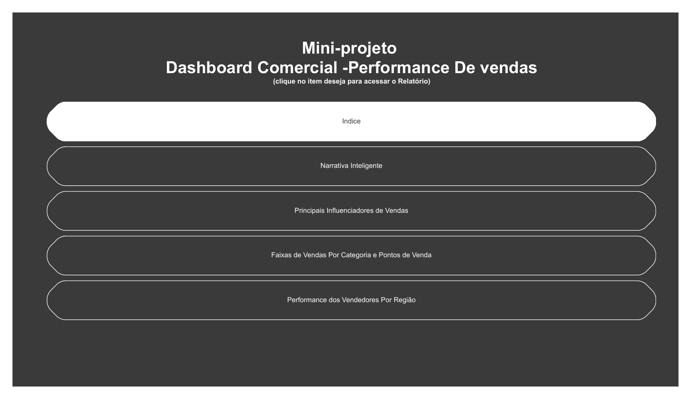
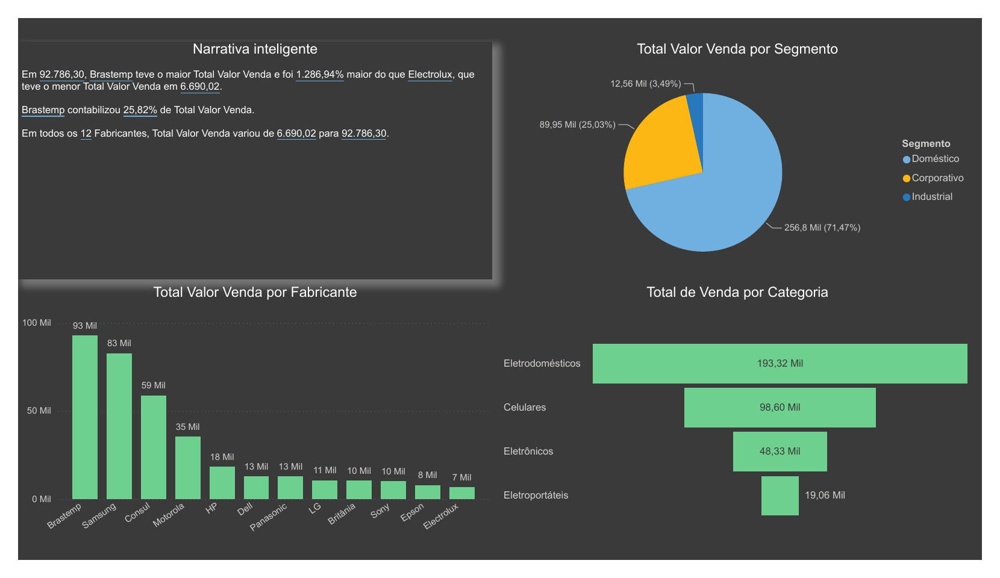
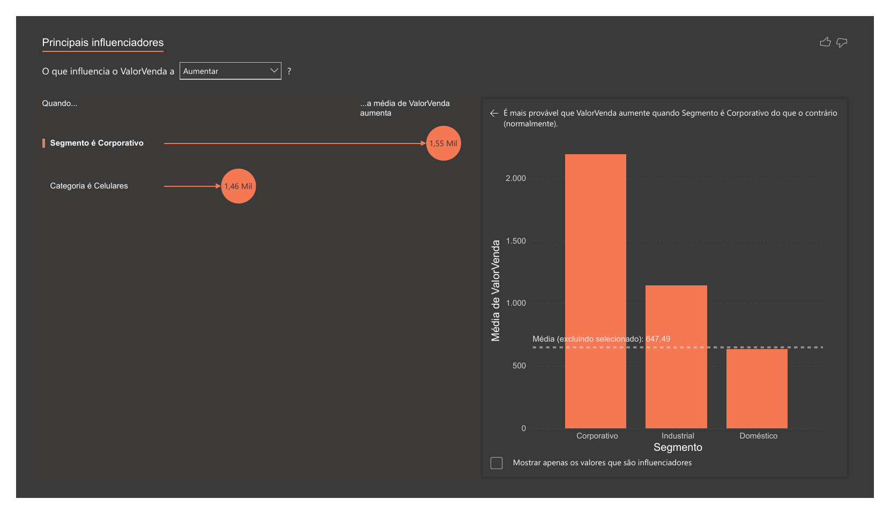
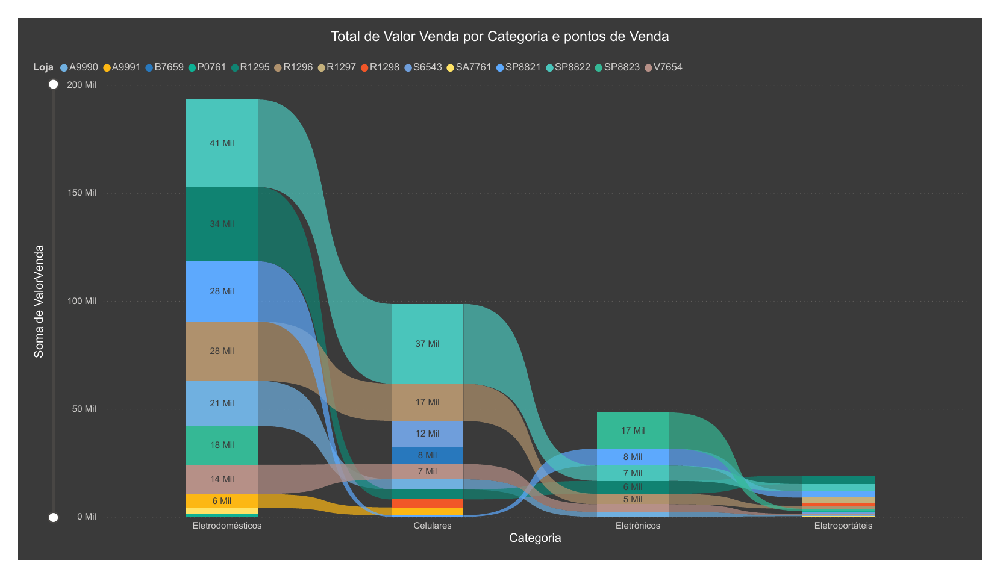
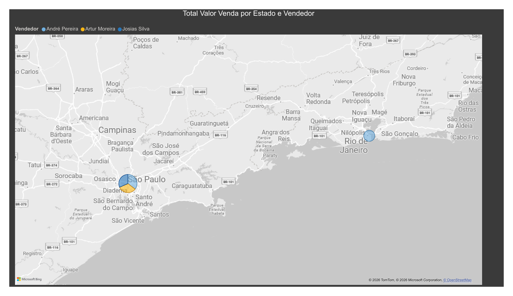

# 📊 Marketing Campaign Analysis — Power BI

Dashboard desenvolvido como parte dos estudos práticos da **Data Science Academy (DSA)**, utilizando o **Power BI** para análise de clientes, comportamento de consumo e desempenho de campanhas de marketing.

---

## 🎯 Objetivo

O projeto tem como objetivo analisar o perfil dos clientes, seus padrões de consumo e os resultados das campanhas de marketing, proporcionando uma visão geral sobre:

- Perfil e características dos clientes;
- Comportamento de gasto;
- Relação entre salário anual e consumo;
- Desempenho das campanhas de marketing;
- Resultados de compra dos clientes;
- Padrões de compra por país e ponto de venda.

---

## 📊 Dashboard

O projeto é dividido em diferentes visões de análise.

### 👥 Visão Cliente

Apresenta uma visão geral do perfil dos clientes, incluindo:

- Total de clientes;
- Salário anual médio;
- Compras realizadas em lojas;
- Compras realizadas pela web;
- Compras realizadas via catálogo;
- Compras com descontos;
- Distribuição de clientes por escolaridade;
- Distribuição de clientes por estado civil;
- Análise por país.

O dashboard apresenta **1.999 clientes** e salário anual médio de aproximadamente **51,98 mil**.

### 💰 Comportamento de Gasto do Cliente

Analisa os padrões de consumo e sua relação com características socioeconômicas e familiares, incluindo:

- Total de gasto × salário anual;
- Total de gasto × quantidade de filhos em casa;
- Total de gasto × quantidade de adolescentes em casa;
- Relação entre gasto, estado civil e escolaridade.

### 📈 Performance das Campanhas de Marketing

Apresenta os resultados das campanhas e a efetividade das ações de marketing, incluindo:

- Clientes que compraram e não compraram;
- Resultado das campanhas de marketing;
- Média de salário anual por resultado da campanha;
- Efetividade da campanha × quantidade de filhos;
- Relação entre resultado da campanha, estado civil e escolaridade.

Na visualização apresentada, aproximadamente **83,99%** dos clientes não realizaram uma compra, enquanto **16,01%** realizaram uma compra.

### 🌎 Padrões de Compras por Ponto de Venda

Analisa os padrões de consumo considerando diferentes países e períodos:

- Total gasto em diferentes categorias por país;
- Total gasto por ano e país;
- Comparação entre países;
- Evolução dos gastos entre 2018 e 2023.

Os países analisados incluem **Estados Unidos, Espanha, Chile, Brasil, Argentina, Portugal e Alemanha**.

---

## 🖼️ Visualizações do Dashboard

### Página 1 — Visão Cliente



### Página 2 — Comportamento de Gasto do Cliente



### Página 3 — Performance das Campanhas de Marketing



### Página 4 — Padrões de Compras por Ponto de Venda



### Página 5 — Visão complementar



---

## 🛠️ Ferramentas

- **Power BI**
- **Power Query**
- **DAX**
- **CSV**

---

## 📁 Estrutura do Projeto

```text
marketing-campaign-analysis/
│
├── README.md
├── dashboard.pbix
│
├── datasets/
│   └── dados_marketing.csv
│
└── images/
    ├── dashboard-page-1.png
    ├── dashboard-page-2.png
    ├── dashboard-page-3.png
    ├── dashboard-page-4.png
    ├── dashboard-page-5.png
    └── dashboard.pdf
```

---

## 📌 Observação

Projeto desenvolvido para fins de aprendizado e construção de portfólio em **Business Intelligence e análise de dados**.
