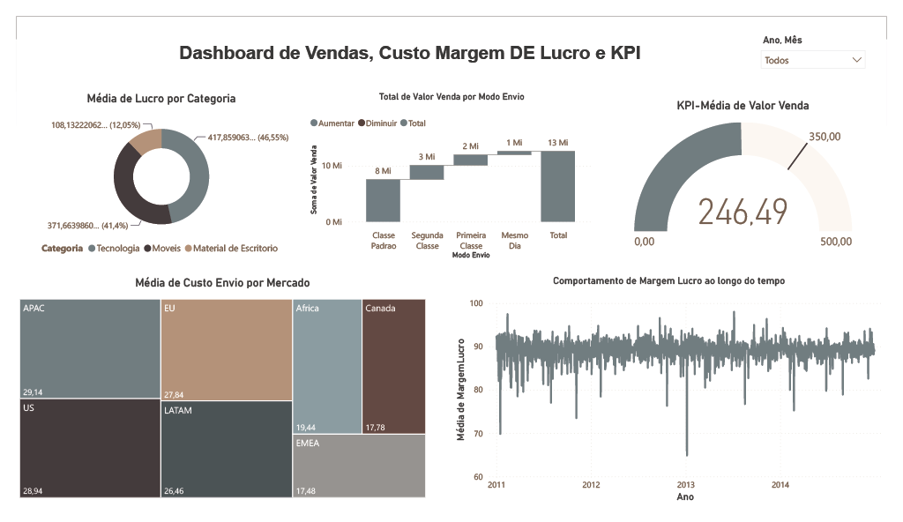

# 📈 Sales & Profitability Dashboard

Dashboard desenvolvido no **Power BI** como parte dos estudos práticos da **Data Science Academy (DSA)**.

## 🎯 Objetivo

Analisar dados de vendas e acompanhar indicadores relacionados a:

- Valor de venda;
- Custo de envio;
- Margem de lucro;
- KPIs de desempenho;
- Categorias e produtos;
- Modos de envio;
- Mercados e regiões;
- Evolução dos resultados ao longo do tempo.

## 🛠️ Ferramentas

- Power BI
- Power Query
- DAX
- Microsoft Excel

## 📷 Dashboard

## 📁 Dados

O projeto utiliza quatro conjuntos de dados:

- **Clientes** — informações de clientes, segmentos, cidades, estados, países, mercados e regiões.
- **Pedidos** — informações dos pedidos, datas, modo de envio e prioridade.
- **Produtos** — categorias, subcategorias e produtos.
- **Vendas** — valores de venda, quantidade vendida e custo de envio.

## 📚 Observação

Projeto desenvolvido para fins de aprendizado e prática de **Business Intelligence, modelagem de dados e visualização de dados** durante os estudos da Data Science Academy (DSA).
